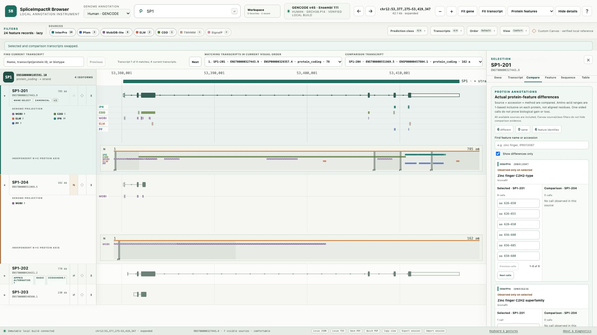
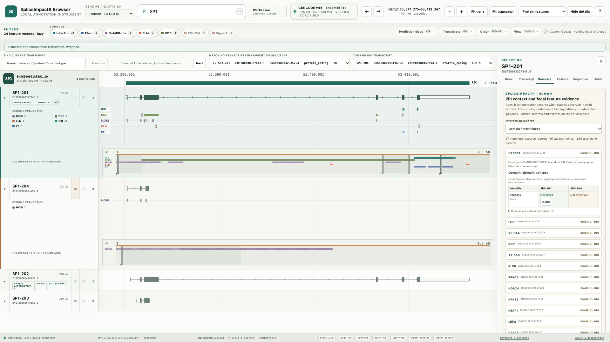

# SpliceImpactR Browser

A local browser for transcript isoforms and exon-aware protein features, powered
by [SpliceImpactR](https://bioconductor.org/packages/release/bioc/html/SpliceImpactR.html).
Prepare the data once, then browse offline.

- Find genes, transcripts and proteins by name or Ensembl identifier.
- Zoom and pan across transcript, exon, CDS and UTR structure.
- View protein domains, motifs, transmembrane regions, signal peptides and
  disorder on both genomic and protein coordinates.
- Compare isoforms using their actual protein-feature annotations and ranges.
- Highlight genomic event intervals across transcript and protein coordinates.
- Inspect sequences and export tables, comparisons and PDF reports.
- Keep favorites, notes and sessions locally.

## Annotations

| Species | GENCODE | Genome assembly | Ensembl features |
| --- | --- | --- | --- |
| Human | [v45](https://www.gencodegenes.org/human/release_45.html) | GRCh38.p14 | 111 |
| Mouse | [M34](https://www.gencodegenes.org/mouse/release_M34.html) | GRCm39 | 111 |

These are the corresponding human and mouse annotation releases. Every
transcript in the source GTF is retained, including low-support, unscored and
noncoding models. Protein-feature coverage varies by transcript and source;
missing features do not remove a transcript.

## Install

### Requirements

- macOS or Linux; Windows users can use WSL2.
- [Python](https://www.python.org/downloads/) 3.9–3.14,
  [Node.js](https://nodejs.org/en/download) 22.13+, and
  [R](https://cran.r-project.org/) 4.6+.
- Internet access for the first setup and enough disk space for dependencies,
  downloaded inputs and the database. The human v45 database alone is about
  3.3 GB.

Linux users should first install the
[R build prerequisites](docs/data_preparation.md#system-prerequisites).

```bash
git clone https://github.com/zachpwakefield/transcript-browser-shareable.git
cd transcript-browser-shareable
./scripts/setup_local.sh
```

This installs the project dependencies and the Bioconductor SpliceImpactR
package, prepares the human v45 annotation and protein features, builds the
database, and starts the browser. Open the local URL printed in the terminal.
First preparation can take a while; rerun the same command to resume an
interrupted download. Data and dependencies are downloaded locally, not bundled
in this repository.

For mouse, replace the final command with:

```bash
./scripts/setup_local.sh --dataset mouse-gencode-m34
```

Both datasets can be installed. Restart the server after adding a dataset, then
choose it in **Genome annotation**. To build without starting the server, add
`--no-start`.

You can also use GitHub's **Code → Download ZIP**, extract it, and run the setup
command from that folder. Setup manages pnpm automatically if needed. A
whole-genome FASTA is not required.

For existing annotation files or separately managed SpliceImpactR inputs, see
[data preparation](docs/data_preparation.md).

## Use

Start an already prepared browser from the project folder:

```bash
./run_local.sh
```

Use `./run_local.sh --dataset mouse-gencode-m34` to start with mouse selected.
For a clickable macOS/Dock launcher, follow the
[Mac app instructions](desktop_app/README.md).

1. Search for a gene, transcript, protein or genomic interval.
2. Use **Fit gene**, **Fit transcript**, zoom and pan to navigate.
3. Expand a translated transcript to inspect its protein features. In **View**,
   choose **All**, **Top** or **None** for default protein tracks. Top means the
   first translated transcript, not a quality ranking.
4. Choose a second transcript and open **Compare** to see shared and differing
   feature calls, accessions and amino-acid ranges. Range differences alone do
   not establish biological domain gain or loss.
5. Use the inspector for feature details, sequences and exports.

InterPro, Pfam, CDD, TMHMM, SignalP, MobiDB-lite and ELM are separately
filterable. Genomic feature segments follow coding exons; the protein view keeps
a continuous N-to-C scale.

To mark an event, open **Event highlights**, paste `chrX:1-3,5-9,22-50`
(or your actual intervals), then **Add highlights**. Coordinates are 1-based
inclusive. The app shows exon-overlapping transcript bases and residues touched
in each verified coding map—not predicted effects on splicing or proteins.

Optional human **PPI context** adds recorded gene partners and compares their
listed feature requirements with each isoform's annotations. It is not a
validated interaction gain/loss prediction and is not available for mouse.
See [how to enable it](docs/data_preparation.md#optional-human-ppi-context).

## Screenshots

### Exon-aware protein features


### Isoform feature comparison



<details>
<summary>Human interaction context and sequence inspection</summary>




</details>

## Guides

- [User guide](docs/user_guide.md)
- [Data preparation and existing inputs](docs/data_preparation.md)
- [Genome datasets and release matching](docs/genome_datasets.md)
- [Testing](docs/testing.md) and [known limitations](docs/limitations.md)
- [Contributing](CONTRIBUTING.md)
- [Architecture](docs/architecture.md) and
  [original implementation plan](docs/LOCAL_TRANSCRIPT_BROWSER_IMPLEMENTATION_PLAN.md)

## License

Browser source: [MIT License](LICENSE). SpliceImpactR and the underlying annotation
resources retain their own licenses and data terms; see
[third-party notices](THIRD_PARTY_NOTICES.md).
