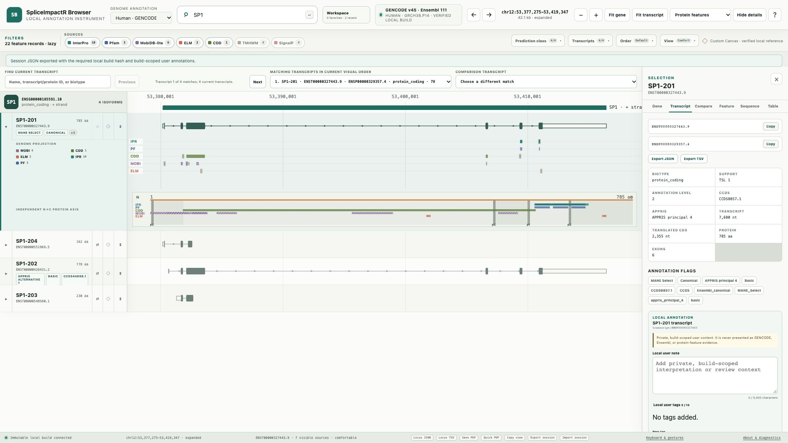
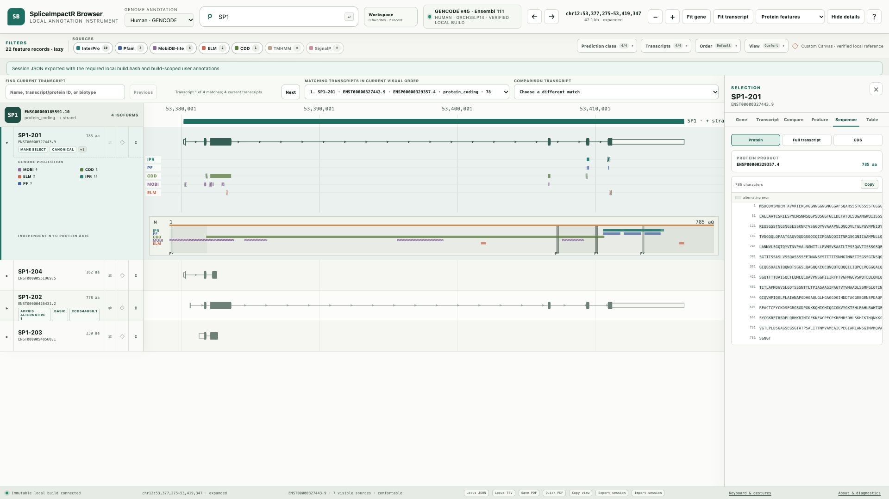

# Local Transcript Browser

An offline-first genome/transcript browser for GENCODE v45 transcript structure and exon-aware protein features. It is designed for fast local inspection of genes and isoforms without depending on a hosted Ensembl session.

This repository contains the browser source, deterministic SQLite builder, tests, documentation, and the adapter that prepares inputs with the Bioconductor SpliceImpactR package. It does **not** contain scientific data products or third-party package source: the GTF, FASTA files, RDS feature tables, SQLite database, reference index, virtual environments, frontend dependencies, desktop bundles, local notes, logs, credentials, or machine-specific receipts are generated or supplied locally.

## Contents

- [What it does](#what-it-does)
- [Example screenshots](#example-screenshots)
- [Quick start](#quick-start)
- [How SpliceImpactR feeds the browser](#how-spliceimpactr-feeds-the-browser)
- [Data contract](#data-contract)
- [Run and use the browser](#run-and-use-the-browser)
- [Verification and publication](#verification-and-publication)
- [Testing guide](docs/testing.md)
- [Contributing](#contributing)
- [Repository map](#repository-map)
- [Licensing and attribution](#licensing-and-attribution)

## What it does

The browser combines a genome-browser-style locus view with transcript and protein interpretation:

| Area | Functionality |
| --- | --- |
| Search | Exact or prefix search for gene symbols, Ensembl gene/transcript/protein IDs, transcript names, exon identifiers, and genomic coordinates. Ambiguous symbols are presented for explicit selection rather than guessed. |
| Locus navigation | Zoom, pan, ruler selection, fit-to-gene/transcript, chromosome labels, packed broad-locus overview, transcript detail thresholds, and a dense-gene minimap. Pointer, keyboard, trackpad, and keyboard-focus interactions are supported. |
| Transcript models | GENCODE gene/transcript/exon/CDS/UTR/start-codon/stop-codon geometry, strand and phase, versioned identifiers, transcript biotypes, canonical/MANE/APPRIS/Basic/CCDS flags, and stable transcript labels. |
| Protein features | Expand a transcript to reveal protein-domain and motif lanes. InterPro, Pfam, CDD, TMHMM, SignalP, MobiDB-lite, and ELM remain separately filterable and are never silently reclassified. |
| Exon-aware projection | Amino-acid intervals are mapped through CDS pieces. A domain crossing an intron appears as separate exon-confined genomic segments plus an independent continuous N-to-C protein lane. |
| Comparison | Keep up to 25 protein rows expanded, reorder visible transcripts with accessible controls, compare two isoforms, pin context, and preserve the visual order in bounded exports. |
| Inspection/export | Cross-highlight feature segments, inspect tables and sequences, export JSON/TSV/CSV, and create bounded selectable-text/vector PDF reports with exact coordinate and sequence labels. |
| Local workspace | Build-scoped recents, favorites, notes, tags, URL state, session export/import, keyboard shortcuts, and diagnostic receipts are stored locally and remain separate from scientific annotation evidence. |
| Runtime | A read-only FastAPI service and React/TypeScript frontend run on loopback. After the data build, normal use is offline: no CDN, remote font, hosted registry, telemetry, permissive CORS, or runtime annotation fallback. |

The interface intentionally follows the useful genome-browser ideas users expect from Ensembl, IGV, and UCSC, but uses one shared local layout model for accessible controls, Canvas rendering, hit testing, scrolling, and protein-row geometry. This avoids the synchronization problems that can arise when several independent renderers own the same transcript rows.

## Example screenshots

These examples are captured from the small SP1 acceptance fixture used during development. They demonstrate the interface and interaction model only; the fixture is not a substitute for a prepared GENCODE v45 build and is not included as scientific data in this source-only repository.

### Expanded protein-feature track

Expanding a transcript adds exon-confined genomic feature segments and an independent continuous N-to-C protein axis. Source badges and the inspector stay synchronized with the visible row.



### Transcript comparison

The comparison inspector makes isoform differences explicit, including transcript/CDS/protein lengths, annotation flags, and per-source feature counts. “Different” is written in the table rather than communicated by color alone.


### Protein sequence inspection

The sequence inspector provides the versioned protein identifier, copy/export affordances, exon overlays, and a readable amino-acid sequence that mirrors the selected transcript.



## Quick start

The following commands create a complete local build. Run them from a fresh clone; the paths are examples, not required locations.

### Requirements

- Python 3.9–3.14 for the API and builder (isolated backend checks use 3.9 and 3.14; source CI covers 3.9, 3.11, and 3.14).
- Node.js 22.13+ and pnpm 11.7+ for the production frontend.
- R 4.6+ and the compatible Bioconductor release for [SpliceImpactR](https://bioconductor.org/packages/release/bioc/html/SpliceImpactR.html) (released package >=1.0.0). The same R installation reads RDS files during the build; R is not used while browsing.
- Network access during preparation only. Runtime browsing is local/offline.

Use macOS or Linux; on Windows, use WSL2 (the builder uses Unix file locks).
Install Python from [python.org](https://www.python.org/downloads/), Node from
[nodejs.org](https://nodejs.org/en/download), and R from
[CRAN](https://cran.r-project.org/). A Conda environment is optional, not required.

On Ubuntu/Debian or WSL2 Ubuntu, install the source-build prerequisites before
running setup (an administrator may need to do this once):

```bash
sudo apt-get update
sudo apt-get install --no-install-recommends -y \
  build-essential gfortran cmake pkg-config \
  libcurl4-openssl-dev libssl-dev libxml2-dev libpng-dev \
  zlib1g-dev libbz2-dev liblzma-dev
```

These are compiler tools and development libraries for R's dependencies, not
annotation filters or a `samtools` requirement. In particular, missing
`curl/curl.h` or `png.h` prevents SpliceImpactR's dependency chain from installing.
Other Linux distributions need their corresponding development packages;
the Ubuntu command must not be used on macOS.

If R is installed from Conda/source rather than the native macOS installer,
ensure its compiler toolchain and CMake are available for source dependencies
such as `nloptr`. A failed install must be retried after fixing that prerequisite;
the setup never treats a missing SpliceImpactR package as success.

The simplest first setup is:

```bash
git clone https://github.com/zachpwakefield/transcript-browser-shareable.git
cd transcript-browser-shareable
./scripts/setup_local.sh
```

This installs dependencies in the project Python environment and active R
library, builds the frontend, downloads annotation/features, validates a full
database, and starts the server. If pnpm is absent, it uses a pinned pnpm via
`npx` without a global installation. Add `--no-start` to build without launching.
No `samtools` or whole-genome FASTA is needed. First preparation can be lengthy;
keep the cache and rerun the same command after an interrupted download/query.
Do not confuse successful source-only tests with a successful full setup.

Alternatively, use **Code → Download ZIP** on the GitHub repository page,
extract it, open a terminal in the extracted folder, and run
`./scripts/setup_local.sh`. Git is not required for this route. Keep that folder
for later runs; the source ZIP does not include prepared data or dependencies.

The validated unfiltered SQLite database is about 3.33 GB, in addition to
dependencies and caches. Rebuilding temporarily needs room for both the old
and new database.
If no existing R package library is writable, the installer creates R's
configured personal library. Set `R_LIBS_USER` before setup to choose an
isolated library; subsequent preparation/build commands must use the same
setting. R package installation uses that writable library; installing Linux
system prerequisites separately may require administrator privileges.

For separate, inspectable steps:

```bash
git clone https://github.com/zachpwakefield/transcript-browser-shareable.git transcript-browser
cd transcript-browser

# Python runtime for the local API and builder helpers.
python3 -m venv .venv
.venv/bin/python -m pip install --requirement requirements.lock

# Production frontend assets.
cd frontend
pnpm install --frozen-lockfile
pnpm run build
cd ..

# Install SpliceImpactR from Bioconductor into the active R library.
./scripts/install_spliceimpactr.sh

# Download/process GENCODE v45 and obtain the seven protein-feature sources.
Rscript --vanilla scripts/prepare_spliceimpactr_cache.R \
  --output data/cache \
  --base-dir data/spliceimpactr-cache --skip-exon

# Build and validate the immutable SQLite package. A whole-genome reference
# is optional; transcript, sequence, and protein-feature browsing works without
# it. See docs/reference_setup.md only if byte-range reference serving is wanted.
PYTHON=.venv/bin/python ./scripts/build_annotations.sh data/cache --scope full

# Start the local browser.
./run_local.sh
```

Open the printed `http://127.0.0.1:<port>` URL. The server binds to loopback only.
For a clickable Mac/Dock app after the full setup, follow
[`desktop_app/README.md`](desktop_app/README.md). Each user builds it locally;
generated app bundles/private runtime manifests are not shareable releases.

Dependency installation and data preparation require network access. Feature
outputs are reused only when their input signature and file digest match;
`--force` refreshes queries deliberately. Old filtered/unreceipted outputs are
regenerated. The browser does not download annotation data at runtime.

## How SpliceImpactR feeds the browser

The data flow is deliberately explicit:

```text
Unmodified GENCODE v45 GTF + transcript/protein FASTA
  └─ complete-model adapter (no annotation filters)
          + SpliceImpactR (released Bioconductor package)
              ├─ Ensembl 111 BioMart protein features
              └─ ELM linear motifs
          │
          ▼
data/cache/*.rds + raw GENCODE .gz files
          │
          ▼
streaming Python builder + optional GRCh38.p14 reference
          │
          ▼
validated immutable data/builds/gencode_v45/annotation.sqlite
          │
          ▼
loopback API + React/Canvas browser
```

`scripts/prepare_spliceimpactr_cache.R` downloads official raw assets through
BiocFileCache and reads the complete GTF with public `rtracklayer` readers. Its
release-pinned adapter queries the Ensembl 111 BioMart through public `biomaRt`
APIs and processes the results with SpliceImpactR's public `get_manual_features()`
API; ELM instances are matched to the supplied protein sequences. It deliberately does **not**
call `get_annotation()`: that analysis-oriented API defaults to TSL 1–3 and
excludes incomplete CDS models, and its TSL options do not provide an unscored
transcript mode. No private package functions or package source are vendored.

The browser preserves **all 252,930 transcript models and 63,187 genes** in the
pinned GTF, including TSL 4/5, unscored transcripts, every biotype, and incomplete
CDS tags. TSL and annotation flags are metadata, not import filters. Dense-locus
rendering is bounded/virtualized for speed; that does not delete transcripts
from the searchable catalog.

Feature coverage is a separate question. SpliceImpactR 1.0.0's own remote helper
uses a `protein_coding` query and automatic archive discovery. The browser's
public-API adapter avoids those restrictions: it uses the verified
[Ensembl 111 archive](https://jan2024.archive.ensembl.org) and no TSL/biotype
selector. ELM still requires a mapped, sequence-confirmed instance. A missing protein sequence, unavailable feature, or
non-exact CDS mapping does not remove its transcript model. Partial mappings
remain labeled and are not drawn as exact genomic feature projections.

This compatibility path avoids dependence on the current Ensembl website's
archive-list discovery. It does not patch installed packages or switch to
another annotation release. SpliceImpactR still provides feature normalization
and the optional exon audit. Its 1.0.0 manual-feature bounding labels have a
minus-strand defect, so those labels are omitted; exact genomic geometry comes
only from the independently verified raw-GTF builder.

In GENCODE v45, PGK1 has six source transcripts, including a TSL 5 and an unscored
model. A current Ensembl page showing more PGK1 isoforms is a different annotation
catalog/release—not a reason to synthesize missing v45 models. Upgrading the
catalog requires a coordinated release-contract change.

Preparation writes one normalized RDS per source, optional exon-level audit
data, and a relative-path manifest with complete transcript inventory, policy,
versions, counts, and digests. Raw release MD5s are pinned; generated feature
counts/digests describe the actual fresh preparation instead of one computer's
old RDS serialization. Changing features changes the build identity.

### Release pairing

| Input | Release | Why it matters |
| --- | --- | --- |
| Gene/transcript/protein assets | GENCODE human v45 | Defines the transcript models and sequence records shown by the browser. |
| BioMart protein features | Ensembl release 111 | Release paired with GENCODE v45 in this browser contract. |
| Optional reference FASTA | Ensembl release 115, GRCh38.p14 | Enables verified byte-range reference serving when supplied; it is not required for transcript/protein browsing. |

Do not mix releases casually. If a new annotation release is desired, treat it as a new scientific build: update the release contract, expected counts/checksums, tests, and review notes together.

### Preparation commands

Install SpliceImpactR from Bioconductor:

```bash
./scripts/install_spliceimpactr.sh
```

Prepare all browser inputs, including exon-level provenance:

```bash
Rscript scripts/prepare_spliceimpactr_cache.R \
  --output data/cache \
  --base-dir data/spliceimpactr-cache
```

Refresh the cached remote results deliberately:

```bash
Rscript scripts/prepare_spliceimpactr_cache.R \
  --output data/cache \
  --base-dir data/spliceimpactr-cache \
  --force
```

There is no `--filter-tsl` option: browser annotation is always unfiltered.

If GENCODE assets already exist, provide all three raw files to avoid another download:

```bash
Rscript scripts/prepare_spliceimpactr_cache.R \
  --output data/cache \
  --base-dir data/spliceimpactr-cache \
  --gtf /path/to/gencode.v45.annotation.gtf.gz \
  --transcript-fa /path/to/gencode.v45.pc_transcripts.fa.gz \
  --protein-fa /path/to/gencode.v45.pc_translations.fa.gz
```

Use `--skip-exon` when only the seven builder inputs are needed and memory is constrained. The seven source tables are written as `interpro.rds`, `pfam.rds`, `cdd.rds`, `tmhmm.rds`, `signalp.rds`, `mobidblite.rds`, and `elm.rds`.

For full preparation details, explicit input behavior, reference checksums, and the distinction between derived exon provenance and builder geometry, see [`docs/data_preparation.md`](docs/data_preparation.md).

## Data contract

The builder expects this local cache:

```text
data/cache/
├── gencode.v45.annotation.gtf.gz
├── gencode.v45.pc_transcripts.fa.gz
├── gencode.v45.pc_translations.fa.gz
├── interpro.rds
├── pfam.rds
├── cdd.rds
├── tmhmm.rds
├── signalp.rds
├── mobidblite.rds
├── elm.rds
├── *.receipt.json                # per-source verified resume receipts
├── exon_features.rds              # optional provenance output
└── spliceimpactr_manifest.json    # preparation provenance
```

Each source feature RDS must contain:

```text
ensembl_transcript_id  start  stop  chr  strand  feature_id
clean_name  alt_name  database  ensembl_peptide_id  method  name
```

Protein coordinates are 1-based inclusive amino-acid intervals. The browser's SQLite and API geometry uses 0-based half-open genomic intervals; visible labels and copied prose use 1-based inclusive coordinates. Read [`docs/coordinate_contract.md`](docs/coordinate_contract.md) before changing projection code.

The Python builder validates required filenames, feature columns, release lineage, row/count audits, checksums, translation mappings, and primary-contig lengths before atomically publishing a build. If an optional whole-genome reference is supplied, its FASTA/index integrity is validated as well. A failed validation is a stop condition, not a warning to ignore.

The generated database and optional reference are intentionally ignored by Git. Do not commit them unless a separate data-release, licensing, and redistribution decision explicitly authorizes it.

## Run and use the browser

### Start modes

```bash
./run_local.sh                         # normal full validated package
./run_local.sh --dev-fixture            # explicitly labeled SP1 development fixture
./run_local.sh --port 8765 --open      # choose a port and open the browser
./run_local.sh --full-database-verify
```

Normal startup refuses a missing, stale, technical-preview, checksum-invalid, or lineage-inconsistent package. The development fixture is never silently substituted for a full build.

The SP1 fixture is a development/acceptance aid and is not included in this source-only distribution. Use `--dev-fixture` only after a downstream workflow has created the corresponding local fixture package.

### Main workflows

1. **Find a locus.** Search by symbol, stable ID, transcript name, protein ID, exon ID, or `chr:start-end`. Exact stable identifiers resolve directly; genuinely ambiguous gene symbols remain explicit choices.
2. **Navigate the locus.** Use Fit gene/transcript, zoom controls, drag-pan, ruler selection, keyboard focus, or trackpad gestures. Broad regions show packed/density summaries; narrower regions reveal individual transcript models.
3. **Choose a transcript.** Open the current-gene navigator, filter by biotype or annotation flags, pin rows, reorder visible transcripts, or use `J`/`K` to move through filter-matched rows.
4. **Inspect protein features.** Select **Protein features** and expand a translated transcript. The genomic lane shows exon-confined projections; the protein inset shows the continuous amino-acid interval. Filter source databases or typed prediction classes, hover for cross-highlighting, and inspect the table/sequence mirror.
5. **Compare isoforms.** Set a comparison transcript, keep selected/comparison/pinned context visible, and use the comparison panel to distinguish zero, missing, not-applicable, and not-yet-loaded values.
6. **Save or share locally.** Export bounded JSON/TSV/CSV data, create a selectable-text/vector PDF, or export/import a build-scoped session. Notes and tags are explicitly local user content and are excluded from scientific PDF evidence.

### Full feature surface

- **Search and resolution:** bounded result palettes, coordinate search, gene/transcript/protein ownership resolution, stable ambiguity handling, recents, favorites, and current-gene transcript search.
- **Genome view:** shared row layout, Canvas rendering, accessible label rail, density levels, packed genes, transcript detail thresholds, minimap, ruler selection, pan/zoom gestures, and device-pixel-ratio safeguards.
- **Transcript detail:** exon, CDS, UTR, codon, phase, strand, translation status, sequence excerpts, versioned identifiers, and annotation flags.
- **Protein lanes:** seven independent local sources, source filters, prediction classes (TMHMM, SignalP, MobiDB-lite, ELM), continuous protein scale, genomic projection segments, overlap menus, and inspector cross-highlighting.
- **Expansion/comparison:** additive independent expansion up to 25 rows, stable reserved row geometry while features load, accessible reorder controls, pins, comparison context, and bounded visual-order export.
- **Persistence:** URL/deep-link state, validated last-view restore, browser-local notes/tags, portable session merge with conflict reporting, and private diagnostics that redact home-directory paths and non-loopback origins.
- **Keyboard/interaction:** `/` focuses global search, `J`/`K` move through current-gene transcripts, `P` toggles a pin, `C` opens comparison, `Shift+C` assigns comparison context, and Page/Home/End operate the transcript viewport when focus is outside editing controls.
- **Output:** JSON/TSV machine exports, one-gene CSV/TSV comparison exports, exact sequence excerpts, and bounded PDF reports. Requests exceeding safety limits are refused instead of silently truncated.
- **Runtime/API:** read-only manifest, search, region, gene, transcript, feature, sequence, export, health, and PDF endpoints served from the same loopback origin as the production frontend. Reference-range endpoints are available only when an optional verified reference is supplied.

The main API surface is intentionally small and read-only: `GET /api/v1/health`, `/manifest`, `/search`, `/region`, `/genes/{identifier}`, `/transcripts/{identifier}`, `/transcripts/{identifier}/features`, `/transcripts/{identifier}/sequence`, `/features/{feature_id}`, and `/export`; `POST /api/v1/report/pdf` creates a bounded local report. The frontend is the reference client, but these endpoints make the built package useful for scripts and reproducible local analysis as well.

The operational limits and remaining cross-browser/scientific review gates are documented in [`docs/limitations.md`](docs/limitations.md) and [`docs/release_checklist.md`](docs/release_checklist.md).

The complete product and engineering blueprint is retained as design
provenance in [`docs/LOCAL_TRANSCRIPT_BROWSER_IMPLEMENTATION_PLAN.md`](docs/LOCAL_TRANSCRIPT_BROWSER_IMPLEMENTATION_PLAN.md).

## Verification and publication

Run the source/privacy audit before every commit:

```bash
./scripts/verify_publication.sh
```

Recommended checks after dependencies are installed:

```bash
./scripts/test_source.sh
python3 -m unittest discover -s tests/data -p 'test_*.py' -v
.venv/bin/python -m unittest discover -s backend/tests -p 'test_*.py' -v
cd frontend
pnpm test
pnpm run typecheck
pnpm run build
cd ..
```

The included [GitHub Actions workflow](.github/workflows/ci.yml) repeats the
publication audit, backend/packaging tests on Python 3.9/3.11/3.14, frontend
tests, TypeScript checks, production build, released-package R adapter
integration, and native Mac launcher compilation/signing. It runs on `main`
pushes and pull requests. Use `./scripts/test_source.sh --require-all` after
installing dependencies to make missing test environments fail rather than
skip. The full release gate additionally requires a prepared full database,
deterministic rebuild receipt, offline audit, cross-browser interaction review,
fresh-environment replay, and domain-scientist interpretation review.

For the staged SP1 build, live API smoke test, manual genome-browser checklist,
and full release gate, see [`docs/testing.md`](docs/testing.md). The latest
isolated local setup evidence and its remaining review boundaries are in
[`docs/setup_validation.md`](docs/setup_validation.md).

After each module or larger section, review both success and failure paths: missing inputs, stale builds, coordinate mismatches, empty versus failed feature results, ambiguous identifiers, oversized requests, focus/scroll ownership, external-resource leaks, and accidental local-path disclosure. Keep automated, manual browser, and biological interpretation evidence separate. See [`docs/critical_review_addendum.md`](docs/critical_review_addendum.md).

## Contributing

See [`CONTRIBUTING.md`](CONTRIBUTING.md) for the source-only contribution policy, required checks, and review expectations. Pull requests should explain the user-visible behavior or scientific contract they change and include focused tests where practical.

## Repository map

```text
backend/app/                 read-only API, validation, PDF/report endpoints
backend/builder/             streaming GTF/FASTA/RDS → SQLite builder
frontend/src/                React controls, Canvas genome view, inspectors
frontend/tests/              frontend behavior and interaction contracts
r/                           complete-model adapter, R preflight/export helpers
scripts/                     data preparation, build, audit, benchmark helpers
spliceimpactr/README.md       Bioconductor dependency notes
docs/                        data, architecture, coordinate, review, and release docs
docs/assets/                 static README screenshots from the SP1 UI acceptance fixture
desktop_app/                 optional macOS launcher and installer
data/builds/                 generated local builds only; ignored by Git
```

## Troubleshooting

- **SpliceImpactR will not install:** use the R/Bioconductor release listed on its [Bioconductor package page](https://bioconductor.org/packages/release/bioc/html/SpliceImpactR.html), then rerun `./scripts/install_spliceimpactr.sh`. The browser does not need SpliceImpactR at runtime.
- **The adapter says a source is missing:** provide all three raw GENCODE paths together, or rerun preparation to resume. `--skip-exon` omits only an optional audit table, not any transcript or protein source.
- **A feature checksum or count fails:** rerun preparation, using `--force` if outputs were modified; keep GENCODE v45 paired with Ensembl 111. Do not edit the manifest by hand.
- **An old preparation manifest is rejected:** rerun preparation to replace legacy filtered outputs with complete-model inputs and v2 receipts.
- **A remote query fails:** retry the same preparation command; completed, verified sources are retained. Do not switch to a current Ensembl release or publish an empty failed query as a substitute.
- **Optional reference verification fails:** follow [`docs/reference_setup.md`](docs/reference_setup.md) and regenerate the index with the same FASTA bytes, or omit the optional reference for transcript/protein-only browsing.
- **Normal startup refuses the package:** rebuild with `scripts/build_annotations.sh data/cache --scope full`; normal mode requires a full validated annotation build, but not a whole-genome reference.
- **A 26th protein row will not open:** simultaneous expansion is intentionally capped at 25. Collapse a row before opening another.
- **Notes or recents differ between browsers:** they are profile-local by design. Use explicit session export/import when transferring local workspace state.
- **Frontend installation fails in CI or a restricted network:** run `pnpm install --frozen-lockfile` in a networked environment; no frontend dependency tree is checked in.

## Licensing and attribution

The browser's original source and documentation are licensed under the [MIT License](LICENSE), selected by the repository owner. You may use, modify, and redistribute that code, including commercially, while preserving the copyright and license notice.

SpliceImpactR is installed from Bioconductor during data preparation and remains under its upstream GPL-3 license, authorship, citation, and source notices. MIT does not replace any third-party license. Third-party notices are collected in [`THIRD_PARTY_NOTICES.md`](THIRD_PARTY_NOTICES.md).

Reference and annotation files remain subject to their respective GENCODE, Ensembl, BioMart, ELM, and database terms. Review those terms before redistributing generated data. For the critical review and release boundary, see [`docs/release_checklist.md`](docs/release_checklist.md).
